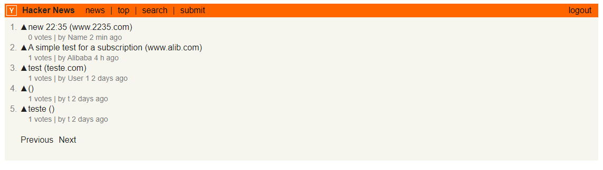

## About

This project has as main objective to simulate a clone of the frontend made in react to the website hackernews (https://news.ycombinator.com/).
This project was developed with the technologies react and react-apollo as being the main pillars of the project and counts with the flow of news registration, the creation of users, the control of authentications and the necessary validations.

## Technologies

The project was developed using the following technologies:

- [reactjs](https://pt-br.reactjs.org/)
- [react-apollo](https://github.com/apollographql/react-apollo)
- [graphql](https://www.npmjs.com/package/graphql)
- [styled-components](https://styled-components.com/)
- [subscriptions-transport-ws](https://github.com/apollographql/subscriptions-transport-ws)

## Minimal Requirements

- NodeJS 10.x
- NPM or Yarn

## Getting Started

<b>This project requires the graphql api located in the repository:</b>

- `$ git clone https://github.com/JeffPatricio/hackernews_graphql`
- 
<b>Cloning the frontend repository:</b>

- `$ git clone https://github.com/JeffPatricio/hackernews_graphql.git`

<b>Download the dependences:</b>

Go to the root of the project and run

- `yarn`

<b>Executing</b>

- `yarn start`

## Feed Screen

## References

[Hacker News](https://news.ycombinator.com/)
